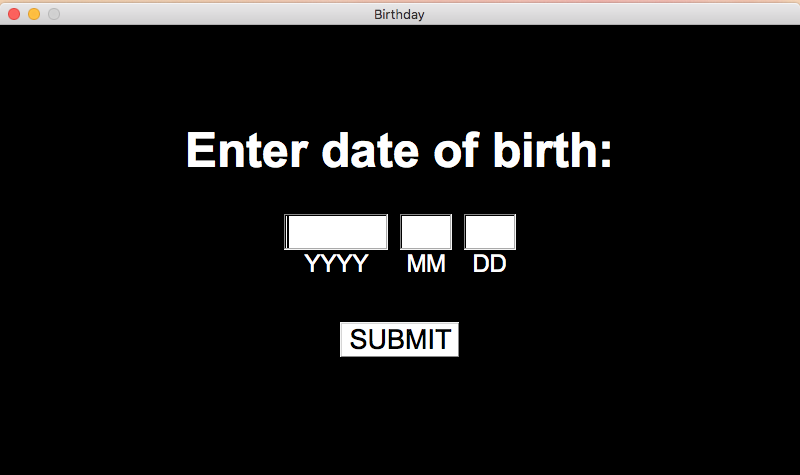
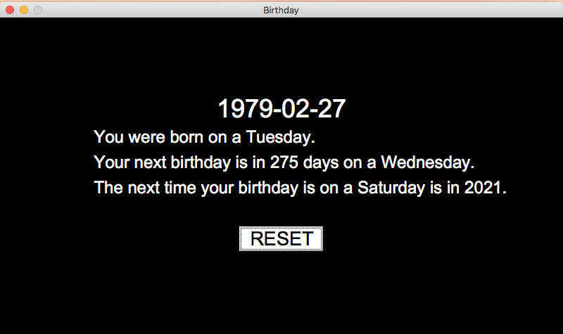

# Birthday

A small project with specific goals:
- build on top of two libraries (FLTK and Boost)
- use a Makefile and learn Makefile best practices
- write tests
- abstract own gui files to static library

This project will be borrowing heavily from Chapters 12-16 of Bjarne Stroustrup's Programming Principles and Practice.
